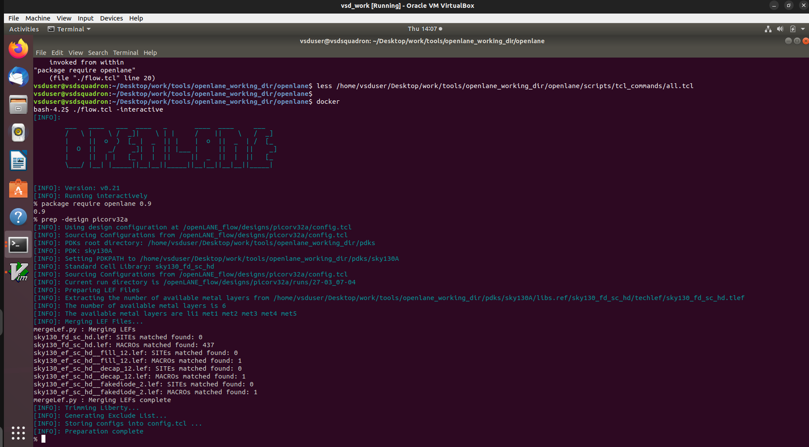
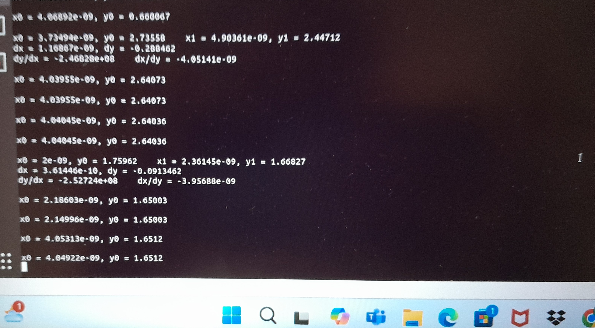

# 🔧 NASSCOM - VSD SoC Design Program

A 5-day learning journey into the world of open-source digital design, focusing on ASIC flow using tools like OpenLANE and the Sky130 process.

---

## 📚 Table of Contents

1. Day 1: Introduction to Open-Source EDA, OpenLane, and Sky130 PDK  
2. Day 2: Floorplanning Fundamentals and Library Cells  
3. Day 3: Magic Layout and SPICE-based Characterization  
4. Day 4: Timing Analysis and Clock Tree Essentials  
5. Day 5: RTL to GDSII Flow - Final Integration  

---

## 📆 Day-wise Summaries

## Day 1: Introduction to Open-Source EDA, OpenLane, and Sky130 PDK

### How to Talk to Computers

In this session, we explored the foundational concepts of communicating with computers, focusing on the architecture and components of integrated circuits.


---

### Introduction to QFN-48 Package, Chip, Pads, Core, Die, and IPs

- **QFN-48 Package**: A surface-mount IC package with 48 pins.
- **Chip Layout**:
  - **Pads**: Points for external connection.
  - **Core**: The heart of the IC where computation happens.
  - **Die**: The silicon wafer that holds the chip.
  - **IPs**: Pre-designed modules integrated into SoCs.
 
    

---

### Introduction to RISC-V

- RISC-V is an open-standard ISA based on reduced instruction set computing principles.
- Enables modular, extensible processor designs for SoCs and embedded applications.

---

### OpenLane and RTL to GDSII Flow

**OpenLane** is an open-source automated digital design flow from RTL to GDSII, integrating tools like Yosys, OpenROAD, Magic, Netgen, etc.

- Automates synthesis, floorplanning, placement, CTS, routing, and DRC/LVS checks.
- Uses **Sky130 PDK** for fabrication-compatible design rules.


---

## LAB : SKY130_D1_SK4 - Synthesis using Yosys

- First, navigate to the design directory:`cd ~/Desktop/work/tools/openlane_working_dir/openlane`.To open the openlane instance:

```bash
docker
# calls the docker instance for the openlane
./flow.tcl -interactive
# opens openlane terminal
package require openlane 0.9
# calls openlane 0.9
prep -design picorv32a
# prepares Picorv32a design for implementation
designs/picorv32a/runs/<run_id>/


run_synthesis
# runs synthesis and abc's
```


- In runs/<run_id>/ folder, there's a config.tcl file that shows the actual configuration parameters used during the run, which may differ from the original `designs/picorv32a/config.tcl` file. This allows inspection of what defaults were applied during flow execution.
- After the run is complete, you can inspect the runs directory for output data. The results/ folder contains the synthesized netlist, logs/ stores detailed logs for each stage (like synthesis), and reports/ includes all reports generated during the flow. Among the multiple synthesis reports in reports/synthesis/, the one with the latest timestamp is the most accurate and should be referred to for final results.
  
- To calculate the DFF ratio using the following formula:
FlipFlop Ratio = Number of D Flip Flops / Total Number of Cells
Percentage of DFFs = FlipFlop Ratio * 100
Percentage of DFFs = (1613 / 14876) * 100 = 10.84%

- New files i.e. merged,synthesis are now created in the picorv32a folder


---

### 🗓️ Day 2: Good FloorPlan Vs Bad FloorPlan and Introduction to Library Cells

- Compared effective vs poor floorplans
- Studied standard cells (inverter, buffer, etc.)
- Gained hands-on experience with floorplanning in OpenLane
  

### 🔲 Preplaced Cells Concept
- The top-level logic is divided into smaller cuts or blocks, which are implemented separately.
- Some parts of the circuit are designed in a reusable, black-boxed format — often used multiple times like an IP block.
- Examples include memory blocks, complex clock gating, muxes, comparators, ALUs, etc.
- These blocks are placed and fixed **before** the standard cell placement. Tools do not alter their positions during placement.
- These are called **pre-placed cells**, and must be surrounded with **decoupling cells** to maintain voltage integrity.

### ⚡ Decoupling Cells
- Help maintain stable supply voltage near pre-placed logic blocks.
- Mitigate voltage drops caused by resistance in the power delivery path.
- Act like capacitors that release charge during voltage dips.

### 🔌 Power (PWR) Planning
- If there's only one power supply point, the voltage drop can cause **signal integrity issues**.
- To mitigate this, **power mesh grids** are spread across the chip to ensure minimal distance from power to logic.

### 📍 Pin Placement
- Requires knowledge of how input/output pins will interact with internal logic.
- Affects routing congestion and final performance of the chip.

---

## LAB: Floorplanning & Placement

To understand configuration hierarchy:

```bash
~/Desktop/work/tools/openlane_working_dir/openlane/configuration < design/runs/config.tcl < design/PDK.tcl
```

- The directory `~/Desktop/work/tools/openlane_working_dir/openlane/configuration` contains the **default configuration files** used by OpenLane.
- Inside this folder, there's a `README.md` file that **documents all available configuration variables**. It's a great reference for understanding and customizing your design flow.

- Configuration Priority Order

OpenLane applies configuration settings in the following **priority order**:

```text
1. ~/Desktop/work/tools/openlane_working_dir/openlane/configuration
2. design/runs/config.tcl
3. design/PDK.tcl
```

```bash
  run_floorplan
  # run floorplan

```

###  Floorplan Dimensions and Die Area Calculation
In OpenLane, dimensions are expressed in **unit distance**, where:1000 unit distance = 1 micron


Based on the DEF (Design Exchange Format) file:

- **Width in unit distance** = `660685 - 0` = `660685`
- **Height in unit distance** = `671405 - 0` = `671405`

To calculate the **die area in microns²**:

Die Area = (Width × Height) / (1000 × 1000) = (660685 × 671405) / 1,000,000 ≈ 443587.21 µm²

###  Report and Visualization

- After completing the floorplan step, OpenLane generates a report that includes parameters like die area and aspect ratio.
- To visually inspect the floorplan and layout in a GUI, use the **MAGIC** tool.

> Tip: The `magic` GUI helps to debug DRC issues and inspect placement and routing interactively.
```bash
# in a seperate terminal enter the directory with def filr (results folder in recent run stage : floorplan)
magic -T ~/Desktop/work/tools/openlane_working_dir/pdks/sky130A/libs.tech/magic/sky130A.tech lef read ../../tmp/merged.lef def read picorv32a.floorplan.def &
```
###  Navigating the Layout in `magic` GUI

When using the `magic` GUI to explore your design, here are some helpful shortcuts and tips:

- **Center the design** for better viewing:
  - Press **`s`** to select the entire design.
  - Then press **`v`** to center the view.

- **Zoom into a specific location**:
  - **Left-click** to select the lower-left corner `(x1, y1)`
  - **Right-click** to set the upper-right corner `(x2, y2)`

- **Get pin or object info** in the layout:
  - Hover your cursor over the desired object.
  - Press **`s`** to select it.
  - In the **tkcon** console, type the following command:
    ```
    what
    ```
    This will display details like pin names, net connections, and more.
    


### Library Binding and Placement

- **Library**  
  The library contains multiple **flavors of standard cells**, providing:
  - Functional behavior
  - Timing characteristics
  - Physical layouts  

  These are crucial for synthesis, placement, and routing stages of the flow.

---

- **Placement** refers to the process of positioning the netlist elements (standard cells) **within the core area** defined during the floorplanning stage.

- This placement takes into account:
  - The **pin locations**
  - **Estimated resistance and capacitance** of interconnects
  - **Timing constraints**

- **Signal transition analysis** is performed post-placement to check:
  - Whether the placed cells are receiving signals **within the required timing window**

- If signal transitions are not meeting the required timing:
  - **Buffers are inserted** to reduce delay and improve signal integrity.

> Proper placement is critical for ensuring that the design meets timing and power constraints, and it sets the stage for successful routing.

```bash
run_placement
results/placement
#in above dir results present
```


```bash
# enter the directory with def file - results folder in recent run stage : placement
magic -T ~/Desktop/work/tools/openlane_working_dir/pdks/sky130A/libs.tech/magic/sky130A.tech lef read ../../tmp/merged.lef def read picorv32a.placement.def &
```


---

### 🗓️ Day 3: Design library cell using Magic Layout and ngspice characterization

- Designed and laid out a basic inverter
- Characterized cell using ngspice
- Extracted parameters for use in synthesis
  
### LAB: Custom Inverter Standard Cell

- Clone the custom inverter standard cell design from the GitHub repository: [nickson-jose/vsdstdcelldesign](https://github.com/nickson-jose/vsdstdcelldesign). 

  ```bash
  #Navigate to the openlane working dir
  cd ~/Desktop/work/tools/openlane_working_dir

  #clone cudtom standard cell from github
  git clone https://github.com/nickson-jose/vsdstdcelldesign.git

  # Move into the cloned inverter design directory
  cd vsdstdcelldesign

  # Copy the required Magic technology file from the PDK directory into the current folder
  cp ../../pdks/sky130A/libs.tech/magic/sky130A.tech .

  # Launch Magic with the custom inverter layout
  magic -T sky130A.tech sky130_inv.mag &

  # In the Magic GUI:
  # - Press "s" to select the component under your cursor.
  # - Pressing "s" repeatedly selects all electrically connected components.
  # - After selecting, use the "tkcon" window to run the command below for detailed info:
  #   what

  #for creating spice file

  #inside the magic tkconsole
  extract all

  # creates cell.ext file
  ext2spice

  # creates spice file

  ```
  


-Here we identify nmos,pmos,Drain to drain connection of nmos and pmos,Pwr to Pmos connection,Gnd to Nmos connection.


## Sky130 Tech File

### NGSpice Simulation for Cell Characterization

- **Timing Analysis**: Determine how quickly a cell can respond to input changes. Key metrics include:
  - **Propagation Delay**: Time taken for an input change to affect the output.
  - **Rise/Fall Time**: Time taken for the output to transition from low to high (rise) or high to low (fall).
  - **Setup and Hold Times** *(for sequential elements)*.

- **Power Analysis**: Measure the amount of power consumed by the cell:
  - **Static Power**: Power consumed when the cell is idle (leakage).
  - **Dynamic Power**: Power consumed during switching.

- **Noise Margins**: Determine how much noise a gate can tolerate without malfunctioning.

- **Load and Drive Strength Characterization**:
  - Understanding how the cell performs under various output loading conditions.
  - Determine the maximum fanout it can support reliably.

---

### LAB: Preparing the SPICE Deck for Simulation

To prepare a SPICE deck from the file generated using the Magic GUI, follow these steps:

1. Include library paths containing PMOS and NMOS models.
2. Set the appropriate grid dimensions for the simulation.
3. Ensure the correct model names are used for PMOS and NMOS devices.
4. Add signal, power, and ground connections to your subcircuit.
5. Define the type of simulation (e.g., transient) and set relevant parameters.





### Cell Timing Parameter Calculations-

### Rise Time

Rise Time = Time taken for output to rise to 80% - Time taken for output to rise to 20%

- 20% of output = 0.66 V  
- 80% of output = 2.64 V
  Rise Time = 2.205ns - 2.164ns = 0.041ns
  
### Fall Time

Fall Time = Time taken for output to fall to 20% - Time taken for output to fall to 80%

- 20% of output = 660 mV  
- 80% of output = 2.64 V
  Fall Time = 4.068ns - 4.040ns = 0.028ns

### Propagation Delay (tpHL)

Propagation Delay = Time taken for output to rise to 50% - Time taken for input to fall to 50%

- 50% of 3.3 V = 1.65 V
  Propagation Delay = 2.185ns - 2.149ns = 0.036ns

### Cell Fall Delay (tpLH)

Cell Fall Delay = Time taken for output to fall to 50% - Time taken for input to rise to 50%

- 50% of 3.3 V = 1.65 V
  Cell Fall Delay = 4.053ns - 4.049ns = 0.004ns

  ```bash
  #Download the drc_test folder in home directory
  wget http://opencircuitdesign.com/open_pdks/archive/drc_tests.tgz

  #extract the labs from the zip file
  tar xfz drc_tests.tgz

  #Change directory into the lab folder
  cd drc_tests
  ls -lrt

  #Command to view .magicrc file
  gvim .magicrc

  #open magic tool
  magic -d XR met3.mag& ```


## Drawing a Layer in Magic Layout Tool

To create a layout shape for a specific layer in Magic:

1. Use **left-click and right-click** together to draw a bounding box (BBox) in the layout window.
2. From the **layer palette**, select your desired layer by clicking it using the **middle mouse button**.
3. The drawn box will now be assigned to the selected layer.

>  Tip: Make sure the layer is highlighted before drawing, or your shape might not appear on the intended layer.


```bash
#metal 3-filled area will be associated with  VIA2 mask.
cif see VIA2

#in tkcon
load poly.mag
```


- **Fixing a DRC Rule Violation in `poly.mag`**

To understand and fix a DRC error (e.g., `poly.9`) in Magic, follow these steps:

1. **Open the layout**:
   - Launch Magic and load the `poly.mag` layout file.

2. **Locate the DRC error**:
   - Zoom in to the area flagged with the `poly.9` error.

3. **Understand the error**:
   - Look up the rule definition for `poly.9` on the [Skywater PDK ReadTheDocs](https://skywater-pdk.readthedocs.io/en/latest/).

4. **Inspect the technology file**:
   - Open the `sky130A.tech` file located in the same directory as your layout.
   - Search for the corresponding DRC rule related to the error.

5. **Edit or add the missing rule**:
   - Modify the `.tech` file to add or correct the DRC specification for the `poly.9` rule based on documentation.

6. **Reload Magic**:
   - Restart Magic and re-run DRC to verify if the issue has been resolved.

> ✅ This process helps in understanding how DRC rules are implemented and enforced, and how to customize or debug them using the technology file.

  


---

### 🗓️ Day 4: Pre-layout timing analysis and importance of good clock tree

- Pre-layout vs post-layout timing
- Importance of CTS and reducing clock skew
- Worked with OpenSTA to analyze slack and critical paths

- **Timing Table and Integration of Custom Cells in OpenLane**

- The **timing table** of different size_values models the **delay characteristics** of a standard cell based on two key factors:
  - The **input signal transition time**
  - The **output load capacitance**

-  **Integrating Custom Standard Cell (`sky130_vsdinv`) into OpenLane**

To incorporate the custom inverter design `sky130_vsdinv` into the OpenLane flow, the following files are required:

- A **characterized `.lib` file**: This contains the timing, power, and functional information of the cell.
- A **`.lef` file**: This provides the physical layout details like cell dimensions and pin placements.

These files are generated and exported using the **Magic layout tool**, after completing the layout and running DRC/LVS.

> ✅ Once both files are ready, they can be included in the OpenLane configuration to use the custom cell in digital synthesis and physical design flow.


Commands to open the custom inverter layout:

```bash
# Change directory to vsdstdcelldesign
cd Desktop/work/tools/openlane_working_dir/openlane/vsdstdcelldesign

# Command to open custom inverter layout in magic
magic -T sky130A.tech sky130_inv.mag &

#write lef file
lef write
```


```bash
# Copy lef file and required lib files to 'picorv32a' design 'src' directory.
cp sky130_vsdinv.lef ~/Desktop/work/tools/openlane_working_dir/openlane/designs/picorv32a/src/
ls -ltr

#Edit 'config.tcl' to change lib file
#Add the new extra lef into the openlane flow.
set ::env(LIB_SYNTH) "$::env(OPENLANE_ROOT)/designs/picorv32a/src/sky130_fd_sc_hd__typical.lib"
set ::env(LIB_FASTEST) "$::env(OPENLANE_ROOT)/designs/picorv32a/src/sky130_fd_sc_hd__fast.lib"
set ::env(LIB_SLOWEST) "$::env(OPENLANE_ROOT)/designs/picorv32a/src/sky130_fd_sc_hd__slow.lib"
set ::env(LIB_TYPICAL) "$::env(OPENLANE_ROOT)/designs/picorv32a/src/sky130_fd_sc_hd__typical.lib"

set ::env(EXTRA_LEFS) [glob $::env(OPENLANE_ROOT)/designs/$::env(DESIGN_NAME)/src/*.lef]
```


📷 *[Add your Day 4 image here]*

---

### 🗓️ Day 5: Integration and Final Tape-Out

- Used TritonRoute and Magic to complete routing
- Ran DRC and LVS checks
- Generated GDSII file for submission

📷 *[Add your Day 5 image here]*

---

## 🧰 Tools Used

- **OpenLane**
- **Sky130 PDK**
- **Magic VLSI**
- **ngspice**
- **KLayout**
- **Yosys**
- **OpenSTA**

---


